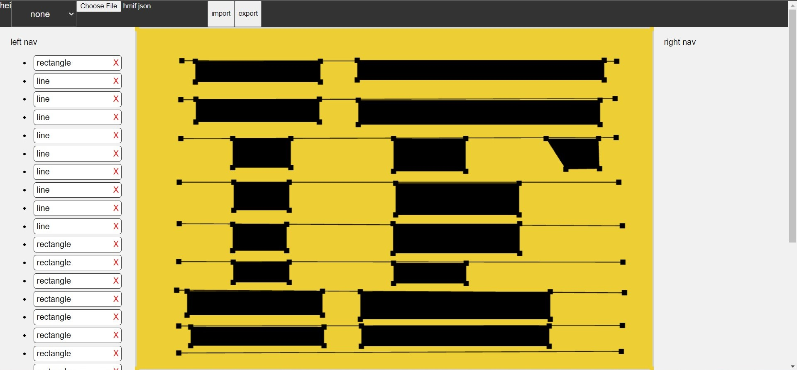
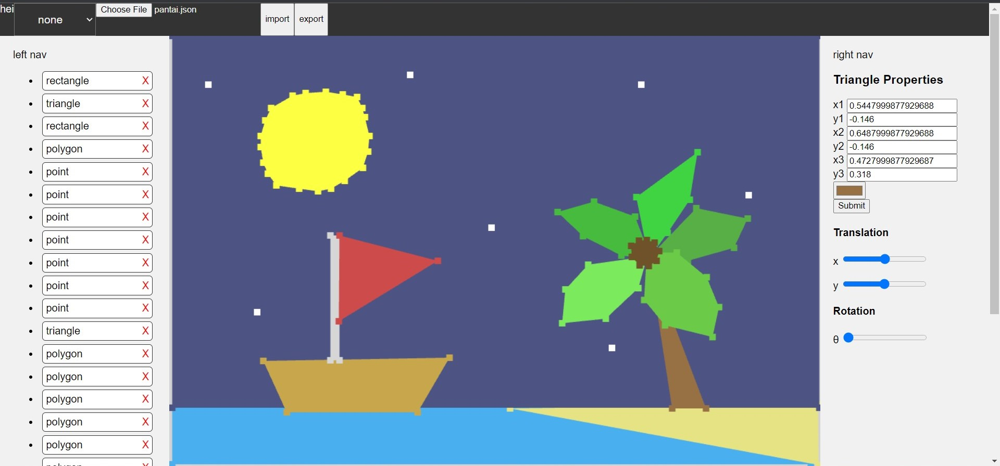

# 2D Web Based CAD (Computer-Aided Design)

## Deskripsi
WebGL merupakan kakas dengan spesialisasi pada ranah grafika yang dapat dengan mudah diintegrasikan pada web. Program memiliki fitur menggambar, mengedit, dan memvisualisasi sejumlah model pada kanvas. 

<i>Model HMIF dengan WebGL</i>

<i>Model Pantai dengan WebGL</i>

## Cara Penggunaan
1. Buka `index.html` pada folder `src`.
2. Gunakan extension live server untuk menjalankan program.
3. Buka `localhost` pada browser sesuai dengan port yang digunakan.

## Kelompok
|    NIM    |          Nama          |
| :-------: | :--------------------: |
| 13520001  | Fayza Nadia            |
| 13520027  | Muhammad Akmal Arifin  |
| 13520055  | Christopher Jeffrey    |